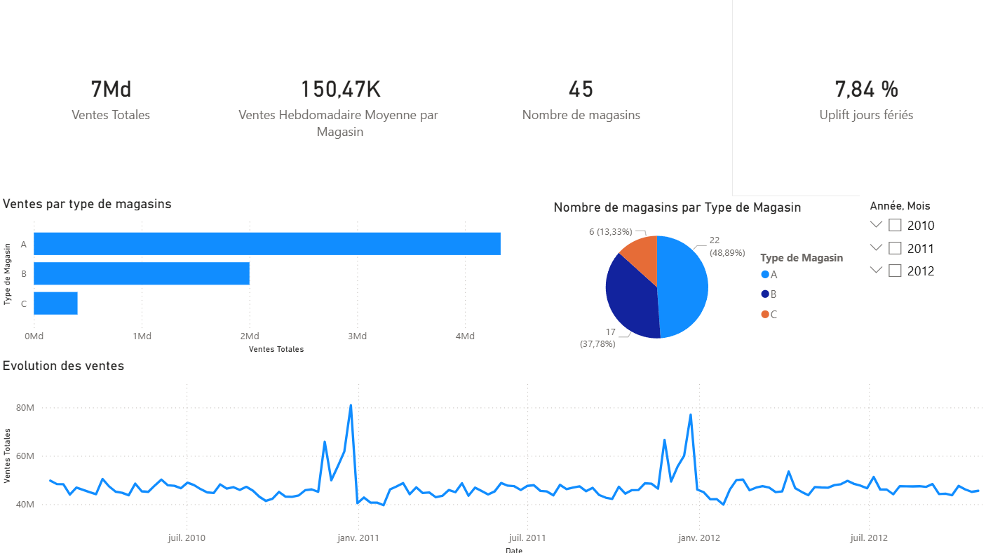
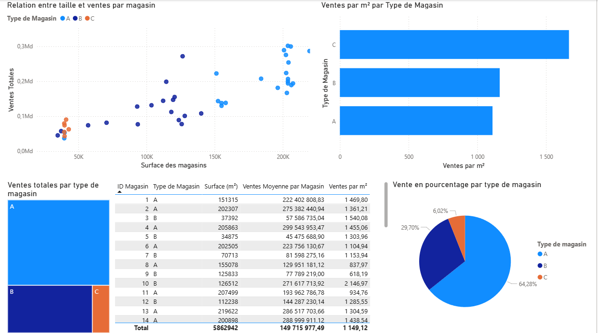
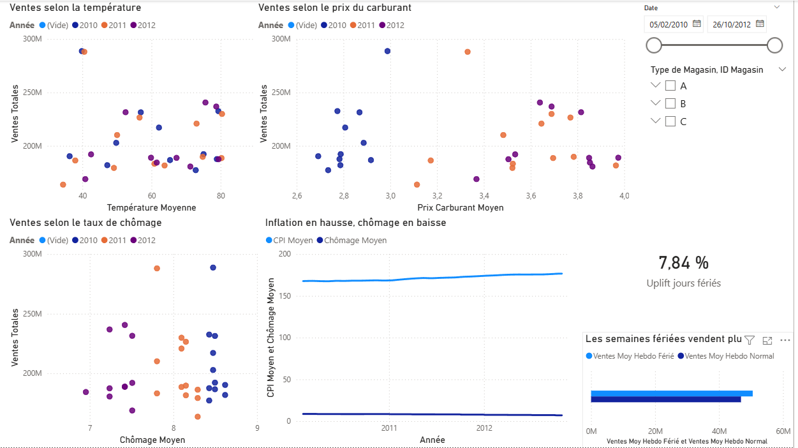
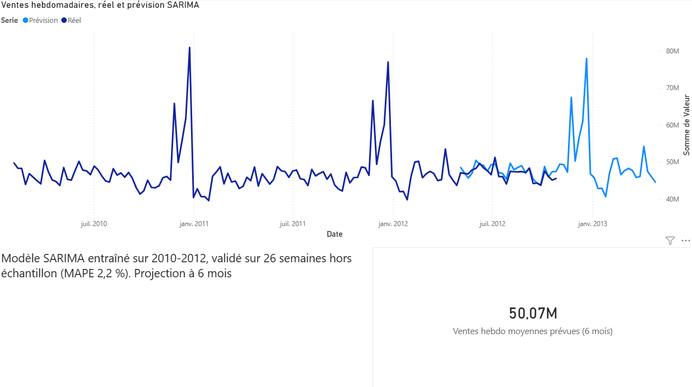
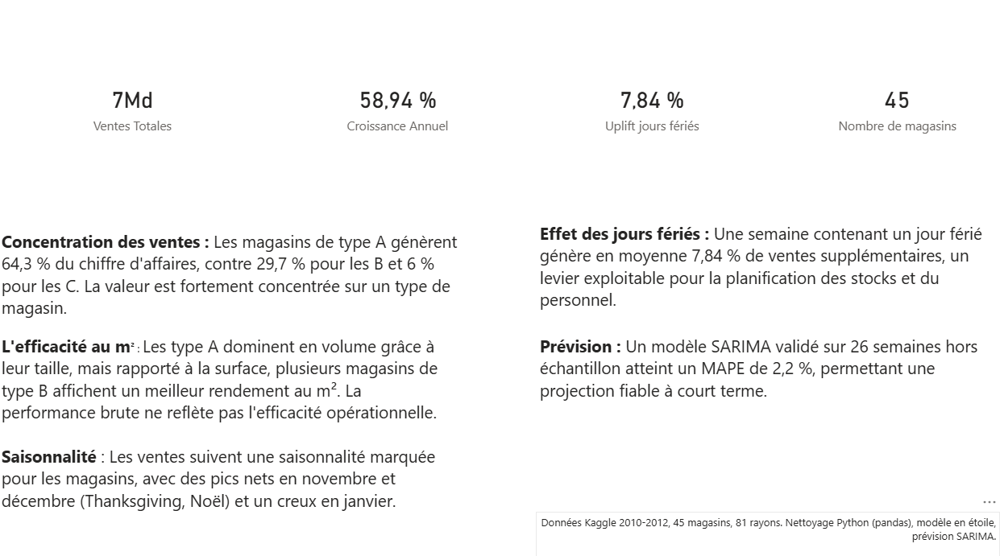

# Analyse et prévision des ventes Walmart


Analyse complète et modélisation prédictive des ventes hebdomadaires de 45 magasins Walmart (2010-2012), du nettoyage des données en Python jusqu'à un dashboard Power BI interactif de 5 pages.

---

## Aperçu du projet

Ce projet part d'un jeu de données Kaggle de ventes retail et le transforme en deux livrables complémentaires :

1. **Dashboard Power BI (5 pages)** : reporting interactif des ventes par magasin, type, rayon, période et facteurs externes.
2. **Modèle de prévision SARIMA** : projection des ventes totales sur 26 semaines, validée sur 6 mois hors échantillon (MAPE 2,2 %).

Source des données : [Walmart Recruiting - Store Sales Forecasting](https://www.kaggle.com/competitions/walmart-recruiting-store-sales-forecasting) (Kaggle).

---

## Contexte métier

Walmart cherche à prévoir les ventes hebdomadaires par rayon et par magasin. Plusieurs éléments donnent au problème sa difficulté réelle :

- Le distributeur lance des opérations promotionnelles (markdowns) avant quatre grandes périodes : Super Bowl, Labor Day, Thanksgiving et Noël.
- Dans la compétition d'origine, les semaines fériées comptent **cinq fois plus** dans le score (métrique WMAE), car ce sont les semaines à fort enjeu commercial.
- Les données de promotions (MarkDown1 à 5) ne sont disponibles qu'à partir de novembre 2011, et de façon incomplète. Ce trou dans les données est assumé et documenté plus bas.

---

## Aperçu du dashboard

<table align="center">
  <tr>
    <td align="center">
      <br>
      <sub><b>1. Vue d'ensemble</b> : KPIs globaux, ventes par type et saisonnalité</sub>
    </td>
  </tr>
  <tr>
    <td align="center">
      <br>
      <sub><b>2. Analyse par magasin</b> : relation taille / ventes et efficacité au m²</sub>
    </td>
  </tr>
  <tr>
    <td align="center">
      <br>
      <sub><b>3. Facteurs externes</b> : météo, carburant, chômage et effet des jours fériés</sub>
    </td>
  </tr>
  <tr>
    <td align="center">
      <br>
      <sub><b>4. Prévision SARIMA</b> : réel vs prévu, projection à 6 mois (MAPE 2,2 %)</sub>
    </td>
  </tr>
  <tr>
    <td align="center">
      <br>
      <sub><b>5. Synthèse</b> : chiffres clés et enseignements métier</sub>
    </td>
  </tr>
</table>

---

## Données

| Caractéristique | Détail |
|---|---|
| Source | Kaggle, Walmart Recruiting Store Sales Forecasting |
| Grain | Magasin x Rayon x Semaine |
| Période | Février 2010 à octobre 2012 (143 semaines) |
| Périmètre | 45 magasins, environ 81 rayons, environ 420 000 lignes |
| Types de magasins | A (grands), B (moyens), C (petits) |
| Variables de contexte | Température, prix du carburant, CPI (inflation), taux de chômage, markdowns |

Fichiers d'origine : `stores.csv` (dimension magasins), `train.csv` (ventes avec cible), `test.csv` (ventes à prédire, sans cible), `features.csv` (contexte régional).

---

## Architecture en 3 couches

```
data/raw/          CSV bruts Kaggle (non versés dans Git)
    |
    v
[Couche 1] src/clean.py
    |              Audit qualité, nettoyage, modèle en étoile
    v
data/processed/    dim_stores.csv | fact_sales.csv | fact_features.csv
    |
    v
[Couche 2] src/prepare_forecast.py  -->  forecast_total.csv
           src/forecast.py          -->  forecast_results.csv
    |              Série temporelle agrégée + SARIMA(0,1,1)(0,1,1,52)
    v
[Couche 3] reports/walmart_sales.pbix
           Dashboard Power BI (5 pages)
```

---

## Le dashboard (5 pages)

| Page | Contenu |
|---|---|
| Vue d'ensemble | KPIs globaux, ventes par type, répartition du parc, courbe de saisonnalité |
| Analyse par magasin | Relation taille / ventes, efficacité au m², classement, table détaillée |
| Facteurs externes | Ventes vs température, carburant, chômage, contexte économique, effet des fériés |
| Prévision | Réel vs prévision SARIMA, projection à 6 mois, MAPE |
| Synthèse | Chiffres clés et enseignements formulés en langage métier |

---

## Mesures DAX principales

| Nom de la mesure | À quoi elle répond |
|---|---|
| `Ventes Totales` | Chiffre d'affaires cumulé (mesure de base) |
| `Uplift jours fériés` | Surcroît de ventes des semaines fériées vs normales (+7,84 %) |
| `Ventes par m²` | Efficacité d'un magasin rapportée à sa surface |
| `% du Total` | Part de chaque type ou magasin dans le total |
| `Prévision Moyenne à Venir` | Niveau moyen des ventes projetées sur 6 mois |

---

## Insights clés

- **Concentration** : les magasins de **type A génèrent 64,3 % des ventes** (contre 29,7 % pour les B et 6 % pour les C), alors qu'ils représentent 22 magasins sur 45. La valeur est fortement concentrée.
- **Efficacité au m²** : les type A dominent en volume grâce à leur taille, mais **rapporté à la surface, plusieurs magasins de type B sont plus efficaces**. La performance brute ne reflète pas le rendement opérationnel.
- **Jours fériés** : une semaine fériée génère **+7,84 % de ventes** en moyenne, un levier pour la planification des stocks et du personnel.
- **Facteurs externes** : aucune variable de contexte prise isolément (météo, carburant, chômage, inflation) n'explique fortement les ventes au niveau agrégé. Ces variables reflètent surtout l'évolution macroéconomique de la période.
- **Prévision** : le modèle SARIMA(0,1,1)(0,1,1,52) atteint un **MAPE de 2,2 %** sur 26 semaines hors échantillon.

---

## Choix méthodologiques

Ces choix sont assumés et défendables, ils constituent une part importante de la valeur du projet.

- **Agrégation au niveau total pour la prévision** : le grain magasin x rayon représente environ 3 000 séries très bruitées. La prévision est donc réalisée sur les ventes totales, une maille lisible et stable. Une version par magasin est identifiée comme amélioration future.
- **Ventes négatives conservées** : environ 0,3 % des lignes ont des ventes négatives (retours supérieurs aux ventes). Elles sont marquées par un drapeau plutôt que supprimées, pour ne pas fausser la réalité.
- **Markdowns manquants remplacés par 0** : avant novembre 2011, un markdown absent signifie une absence de suivi promotionnel, pas une donnée perdue. Le 0 a donc un sens métier.
- **Modèle en étoile** : deux tables de faits (ventes et contexte) de grains différents, reliées par des dimensions conformes (magasin et calendrier), plutôt qu'une table unique aplatie.
- **MAPE bas assumé** : au niveau agrégé, la loi des grands nombres lisse le bruit des magasins individuels, ce qui rend la série plus prévisible. Un MAPE de 2,2 % est donc cohérent, il ne serait pas atteint au grain fin.

---

## Limites et améliorations futures

- La **croissance annuelle** (YoY) est sensible aux années partielles du jeu de données (début en février 2010, fin en octobre 2012). Elle est plus fiable filtrée sur une année complète que lue en chiffre global.
- La métrique officielle de la compétition est le **WMAE** (semaines fériées pondérées x5), non implémentée ici puisque la prévision porte sur le total agrégé et non sur la soumission par rayon.
- Intégrer les variables de contexte dans un modèle **SARIMAX** pour tester leur apport prédictif (le jeu de données fournit déjà les valeurs futures de ces variables).
- Produire une **prévision par magasin** pour un pilotage plus fin.
- Comparer à d'autres approches : **Prophet**, **XGBoost** avec variables temporelles.
- Automatiser le pipeline (script shell ou ordonnanceur type Airflow).

---

## Stack technique

Python (pandas, numpy, statsmodels), Power BI (DAX, modèle en étoile), Git.

---

## Auteur

**Lilian Doublet**

[](https://www.linkedin.com/in/lilian-doublet/)
[](https://github.com/liliandoublet)
